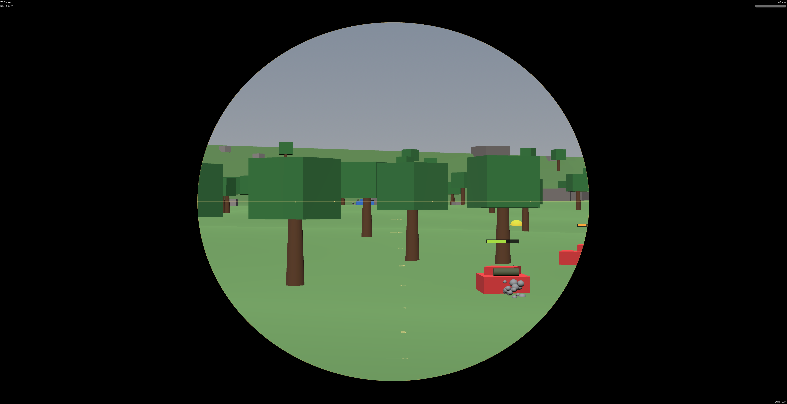

# Tank War World



基于 Godot 4.6 的多人坦克对战。服务器是权威模拟，以无头 Godot 进程运行；客户端可以是原生 Godot 应用，也可以是 HTML5 网页。客户端和服务器之间用自定义二进制协议走 WebSocket，同一个服务器可以同时接入原生客户端和浏览器客户端。

[English → README.md](README.md)

---

## 环境要求

- **Godot 4.6.2** — macOS 下是 `/Applications/Godot.app`，或者把 `godot` 放进 `PATH`。
- **Web 导出模板** (4.6.2) — 只有构建网页客户端才需要。在 Godot 编辑器里 *Editor → Manage Export Templates → Download and Install*（约 700 MB），装完会出现在 `~/Library/Application Support/Godot/export_templates/4.6.2.stable/`。
- **Python 3** — 只是用来本地起一个静态文件服务器。
- **fonttools / `pyftsubset`** — 每次构建网页客户端之前都要先跑字体裁剪（见 §3a），所以必须装。`uv tool install fonttools --with brotli` 或 `pip install fonttools brotli` 都行。

下面示例都用 macOS 的完整路径。如果 `godot` 已经在 `PATH`，可以直接替换成 `godot`。

---

## 1. 启动游戏服务器

服务器始终原生运行，监听 `ws://0.0.0.0:8910`。

```bash
cd /path/to/tank-war-world
/Applications/Godot.app/Contents/MacOS/Godot --headless server/main_server.tscn
```

看到 `[WSServer] Listening on port 8910` 就说明起来了。服务器会自动用机器人填充大厅（默认 10 个），详见 `server/ai/ai_brain.gd`。

**端口 8910 被占用？**

```bash
lsof -iTCP:8910 -sTCP:LISTEN     # 找进程
kill <pid>                        # 干掉残留进程
```

---

## 2. 原生客户端（开发最快）

服务器起好后，另开一个终端：

```bash
cd /path/to/tank-war-world
/Applications/Godot.app/Contents/MacOS/Godot client/main_client.tscn
```

默认连接 `ws://localhost:8910`。

---

## 3. 网页客户端

### 3a. 裁剪中文字体（每次构建前都要跑一遍）

`client/assets/fonts/NotoSansSC-Regular.otf` 是完整的思源黑体（约 8 MB）。下面这个脚本会把它裁剪成只保留 UI 实际用到的字符（约 68 KB，压缩 99%），对网页包体积提升极大。**每次构建网页客户端之前都先跑一遍**；之后只要在客户端 UI 里加了新的中文字符也要重跑。

```bash
cd /path/to/tank-war-world
tools/subset_font.sh
```

如果新增了中文文案，先把新字符加到 `tools/subset_font.sh` 里的 `SUBSET_CJK_TEXT` 变量，然后再跑脚本。

### 3b. 导出网页包（首次构建，或者客户端代码改动后重新构建）

```bash
cd /path/to/tank-war-world
/Applications/Godot.app/Contents/MacOS/Godot --headless \
  --export-release "Web" build/web/index.html
```

会生成 `build/web/{index.html, index.pck, index.wasm, index.js, index.audio.worklet.js}`。导出预设（`export_presets.cfg`）会把 `server/`、`tests/`、`docs/`、GUT 插件排除在外。

### 3c. 本地起网页服务器

浏览器不能从 `file://` 加载 `.wasm`，必须走 HTTP：

```bash
python3 -m http.server --directory build/web 8000
```

### 3d. 打开游戏

浏览器访问：

```
http://localhost:8000/
```

客户端会根据当前页面的 hostname 自动推导 WebSocket 地址（见 `client/main_client.gd:_derive_web_server_url`），所以同一份包能直接部署到任何主机，无需重新构建。

**操作**

| 按键 | 动作 |
|---|---|
| W / A / S / D | 行驶（始终以车体为参考，不跟随炮塔） |
| 鼠标 | 转动炮塔 |
| 左键 | 开炮 |
| 右键（按住） | 进入瞄准镜 |
| 滚轮 | 切换瞄准倍率（2× / 4× / 8×） |
| ESC | 释放鼠标锁定 |

---

## 线上部署（简述）

- 把 Godot 服务器部署到云主机。
- 前面套一个终止 TLS 的反向代理（Caddy / nginx / Cloudflare tunnel），让客户端用 `wss://` 连接。浏览器会拒绝 `https://` 页面下的明文 `ws://`。
- `build/web/` 丢到任何静态托管（GitHub Pages、Cloudflare Pages、S3+CloudFront 都行）。尽量让静态资源和 `wss://` 服务器用同一个 hostname，自动推导的 URL 就能直接工作。

---

## 跑测试

```bash
/Applications/Godot.app/Contents/MacOS/Godot --headless \
  -s addons/gut/gut_cmdln.gd -gdir=res://tests -gexit
```

8 个脚本 60 个测试。每次提交前跑一遍。
